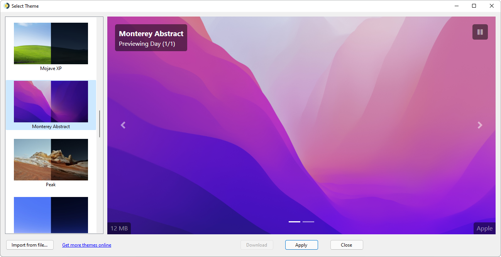
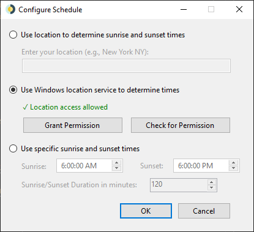

 

# WinDynamicDesktop
Port of macOS Mojave Dynamic Desktop feature to Windows 10. Available on GitHub and the Microsoft Store.

## Themes

Pick any of the themes bundled with macOS, or many more themes available for download [here](https://windd.info/themes/)

## Schedule

Choose a schedule for cycling through wallpaper images over 24 hours

## Supported Devices

WinDynamicDesktop is developed primarily for Windows 10, but should run on any version of Windows with .NET Framework 4.5 or newer installed. If your version of .NET Framework is too old, you can install a newer one from [here](https://www.microsoft.com/net/download).

## Resources

* [Get Help](https://github.com/t1m0thyj/WinDynamicDesktop/wiki)
* [Download Themes](https://windd.info/themes/)
* [Download Scripts](https://windd.info/scripts/)
* [Translate on POEditor](https://poeditor.com/join/project/DEgfVpyuiK)
* [.ddw Theme Creator](https://ddw-theme-creator.vercel.app/) (thanks @gdstewart)

## Known Issues

* [Wallpaper fit not remembered in Microsoft Store app](https://github.com/t1m0thyj/WinDynamicDesktop/wiki/Known-issues#wallpaper-fit-not-saved-with-multiple-monitors)
* [Wallpaper gets stuck and won't update](https://github.com/t1m0thyj/WinDynamicDesktop/wiki/Known-issues#wallpaper-gets-stuck-and-wont-update)

## Limitations

* [Can't change lock screen background](https://github.com/t1m0thyj/WinDynamicDesktop/issues/31)
* [Can't show separate images on multiple monitors](https://github.com/t1m0thyj/WinDynamicDesktop/issues/117)
* [Can't show separate images on multiple virtual desktops](https://github.com/t1m0thyj/WinDynamicDesktop/issues/299)

## Disclaimers

* Wallpaper images are not owned by me, they belong to Apple
* [LocationIQ API](https://locationiq.org/) is used when your enter your location, to convert it to latitude and longitude
* Microsoft Store app uses the Windows location API if permission is granted
* App icon made by [Roundicons](https://www.flaticon.com/authors/roundicons) from [flaticon.com](https://www.flaticon.com/) and is licensed by [CC 3.0 BY](http://creativecommons.org/licenses/by/3.0/)
