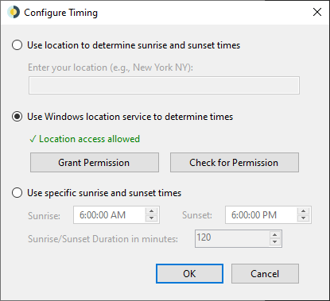

# WinDynamicDesktop
Port of macOS Mojave Dynamic Desktop feature to Windows 10. Available on GitHub and the Microsoft Store.

## Themes

Pick from the 3 themes bundled with macOS, or many more themes available for download [here](https://windd.info/themes/)

## Timing

Choose a schedule for cycling through wallpaper images over 24 hours

## Supported Platforms

WinDynamicDesktop is developed primarily for Windows 10, but should run on any version of Windows with .NET Framework 4.5 or newer installed. If your version of .NET Framework is too old, you can install a newer one from [here](https://www.microsoft.com/net/download).

## Resources

* [Documentation](https://github.com/t1m0thyj/WinDynamicDesktop/wiki)
* [Themes](https://windd.info/themes/)
* [Scripts](https://windd.info/scripts/)

## Known Issues

* [Wallpaper fit not remembered in Microsoft Store app](https://github.com/t1m0thyj/WinDynamicDesktop/wiki/Known-issues#wallpaper-fit-not-saved-with-multiple-monitors)
* [Wallpaper gets stuck and won't update](https://github.com/t1m0thyj/WinDynamicDesktop/wiki/Known-issues#wallpaper-gets-stuck-and-wont-update)

## Disclaimers

* Wallpaper images are not owned by me, they belong to Apple
* [LocationIQ API](https://locationiq.org/) is used when your enter your location, to convert it to latitude and longitude
* Microsoft Store app uses the Windows location API if permission is granted
* App icon made by [Roundicons](https://www.flaticon.com/authors/roundicons) from [flaticon.com](https://www.flaticon.com/) and is licensed by [CC 3.0 BY](http://creativecommons.org/licenses/by/3.0/)
