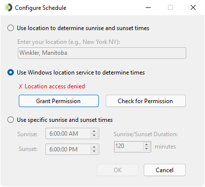

<p align="center">

<br/>
<a href="https://github.com/t1m0thyj/WinDynamicDesktop/releases"></a>
<a href="https://chocolatey.org/packages/windynamicdesktop"></a>
<a href="https://github.com/t1m0thyj/WinDynamicDesktop/actions/workflows/build.yml"></a>
</p>

# WinDynamicDesktop
Port of macOS Mojave Dynamic Desktop feature to Windows 10 and 11. Available on GitHub and the Microsoft Store.

<a href="https://github.com/t1m0thyj/WinDynamicDesktop/releases/latest"></a>
<a href="//www.microsoft.com/store/apps/9nm8n7dq3z5f?cid=storebadge&ocid=badge"></a>

## Themes

Pick any of the themes bundled with macOS, or many more themes available for download [here](https://windd.info/themes/)


### Custom Themes (import from file)

To use custom themes follow the format seen below as an example. 
You will need a directory with your images labled as 1.jpg, 2.jpg etc.., as well as a json file with your configuration to import. 

```powershel
PS C:\Users\JohnDoe\Pictures\Theme\> ls
  Directory: C:\Users\Johndoe\Pictures\Theme

Mode                 LastWriteTime         Length Name
----                 -------------         ------ ----
-a----         10/8/2024   5:21 PM        4524216 1.jpg
-a----         10/8/2024   5:21 PM        5018148 2.jpg
-a----         10/8/2024   5:21 PM        4180552 3.jpg
-a----         10/8/2024   5:21 PM        4183664 4.jpg
-a----        10/11/2024   1:51 PM            166 image.json
```
image.json 

```json
{
  "imageFilename": "*.jpg",
  "imageCredits": "John Doe",
  "sunriseImageList": [1],
  "dayImageList": [2],
  "sunsetImageList": [3],
  "nightImageList": [4]
}
```

## Schedule

Choose a schedule for cycling through wallpaper images over 24 hours



## Scripts

Extend the behavior of WinDynamicDesktop with PowerShell scripts, and share them with other users [here](https://github.com/t1m0thyj/WDD-scripts#readme)

## Supported Devices

WinDynamicDesktop is developed primarily for Windows 11, but should run on any device with Windows 7 or newer. Windows Insider builds are not officially supported.

## Resources

* [Get Help](https://github.com/t1m0thyj/WinDynamicDesktop/wiki)
* [Translate on POEditor](https://poeditor.com/join/project/DEgfVpyuiK)
* [.ddw Theme Creator](https://ddw-theme-creator.vercel.app/) (thanks @gdstewart)

## Known Issues

* [Wallpaper fit not remembered in Microsoft Store app](https://github.com/t1m0thyj/WinDynamicDesktop/wiki/Known-issues#wallpaper-fit-not-saved-with-multiple-monitors)
* [Wallpaper gets stuck and won't update](https://github.com/t1m0thyj/WinDynamicDesktop/wiki/Known-issues#wallpaper-gets-stuck-and-wont-update)

## Limitations
* [Can't show separate images on multiple virtual desktops](https://github.com/t1m0thyj/WinDynamicDesktop/issues/299)

## Disclaimers

* Wallpaper images are not owned by me, they belong to Apple
* [LocationIQ API](https://locationiq.org/) is used when your enter your location, to convert it to latitude and longitude
* Microsoft Store app uses the Windows location API if permission is granted
* App icon made by [Roundicons](https://www.flaticon.com/authors/roundicons) from [flaticon.com](https://www.flaticon.com/) and is licensed by [CC 3.0 BY](http://creativecommons.org/licenses/by/3.0/)
